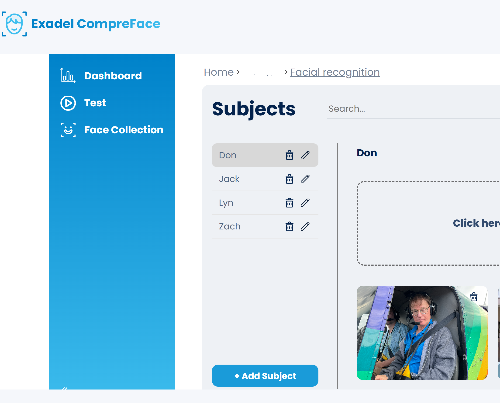

# Facial-Recognition-Processing-for-Home-Assistant
Home assistant facial recognition processing using pyscript and Exadel CompreFace.

## Prerequisites. ##

1. Install Home Assistant integration Pyscript. [https://hacs-pyscript.readthedocs.io/en/latest/]
2. Optional. Install Home Assistant application Grafana. Add plugins: **dalvany-image-panel**  **Grafana Infinity Datasource**
3. Install and setup CompreFace. I recommend you host CompreFace on a separate self hosted server using Docker compose. Adjust docker compose file with port 7215..this is the port my Pyscript is setup to use. [https://github.com/exadel-inc/CompreFace?tab=readme-ov-file]
  

## Installation. ##
1. Copy **aiface.py** to pyscript directory in home assistant.
2. Change the x_api_key in aiface.py to your api key from your installation of CompreFace.
3. Change the URL_CURL and URL_CURL_COMPRE, in aiface.py to your ip addresses. URL_CURL is your home assistant ip address webhook. URL_CURL_COMPRE is your CompreFace hosted IP address.
4. Create directories /config/www/capture/ and /config/AI. 
5. Put or merge with your configuration **template_sensor.yaml**.  This will create **sensor.face_detected_occurrence**.
6. Put or merge with your configuration **input-text.yaml**. This will create **input_text.faces_selected**  and **input_text.face_confidence**. 
7. Put or merge with your configuration **shell_command.yaml**. This will be used to create area subdirectories if necessary.
8. Restart Home Assistant.
9. Import blueprint [https://github.com/ijustlikeit/Facial-Recognition-Processing-for-Home-Assistant/blob/main/blueprints/facial_recognition.yaml]
10. Run blueprint **Motion and facial recognition Blueprint v1.0.0**. Select motion sensor, camera, area in the area you want to do facial recognition. So say you choose the mainfloor, this means you would select a motion and camera entity that are located in your mainfloor area. Save the automation giving it a name and description that is of your choosing. Repeat this step for every area that you wish to do facial recognition in.
11. Remember to change input_text.faces_selected and input_text.face_confidence to your perferences. The name(s) you place in input_text.faces_selected must match the Subjects names you configured in Compreface. Example. 
12. After a successful recognition you will have the **sensor.face_detected_occurrence** populated and ready to use.
13.  Here is one possible use of sensor.face_detected_occurrence. See automation **Facial recognition sample.yaml**.
14.  If you installed the optional step 2 prerequisite for Grafana you can setup and view your face detections. Here is a sample: 

